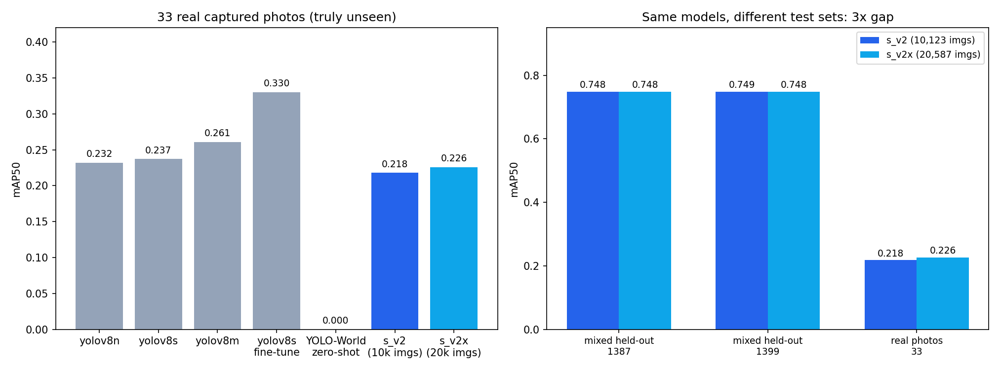
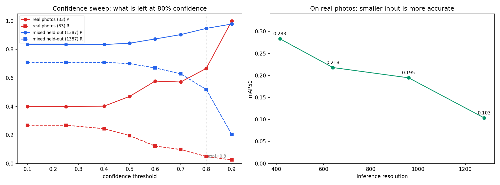

# 捡垃圾小车 · 垃圾检测模型（YOLOv8 单类 `trash`）

给**户外自主拾荒小车**（树莓派 + 摄像头，约 0.5 m 机位）做的垃圾检测器。
这份文档只回答四个问题：**现在到底有多准？外部数据集/现成模型能不能救？为什么？怎么才能真正达标？**

---

## 结论（TL;DR）

1. **现成的通用模型完全不行。** YOLO-World v2 零样本（不训练，只给文字提示）在真实照片上
   41 个垃圾框只蒙对 **0~3 个**（召回 0.0 ~ 0.073）。想不训练直接拿来用，这条路是死的。

2. **去网上再找 1 万张公开数据也没用。** 新增 10,464 张公开垃圾图（74,073 个框）重新训练，
   真实照片上的 mAP50 从 0.218 → 0.226，**在噪声范围内，等于没变**。

3. **真正的瓶颈是"分布不一致"，不是数据量。** 同一个模型，在混合大数据集上 mAP50 = **0.748**，
   在你自己的真实场景照片上只有 **0.218**。**差 3.4 倍。** 谁把公开数据集上的高分当成绩，
   谁就会在真实小车上翻车。

4. **"置信度 > 80% 且准确率 > 90%"目前做不到。** 在真实照片上把阈值提到 0.8，
   剩下的预测正确率 67%，但只找回 4.9% 的垃圾——等于不报警。这是单类 `trash` 任务的
   固有难度（一个类要同时覆盖瓶子/袋子/纸/烟头，外形没有共同点）。

5. **唯一有效的路**：把摄像头装到小车上，在**目标机位、目标光照、目标距离**下录视频抽帧，
   标注 500~1000 张，在这个基础上微调。其余所有手段（换模型、加数据、调分辨率）都被验证为无效。



---

## 一、这次做了什么（第三轮）

| 环节 | 做法 | 结果文件 |
|---|---|---|
| 重建测试集 | 把手上**所有**图片汇总，用 16×16 aHash 做近重复聚类，**按组**切分训练/验证 | `scripts/big_split.py` |
| 找现成模型 | 下载 YOLO-World v2（s/l）零样本评测，文字提示 4 组 / 10 组 | `scripts/zeroshot_eval.py` |
| 去网上找数据集 | HuggingFace 上搜 trash/garbage/litter/waste，取 `keremberke/garbage-object-detection` | `scripts/prep_extra2.py` |
| 防止测试集被污染 | 把 33 张真实照片的近重复图从训练集里彻底剔除再重训 | `scripts/prune_val_leak.py` |
| 诚实评测 | 三个测试集 + 置信度扫描 + 分辨率扫描 | `scripts/eval_honest.py` |

---

## 二、为什么之前的数字不能信（验证集泄漏）

原来的协议是"训练用合并集（4775 张），验证用自采的 73 张真实照片"。听起来干净，实际上：

| 审计项 | 结果 |
|---|---|
| 73 张验证图里在训练集能找到近重复的 | **40 张（55%）** |
| 公开数据集自带的 val 划分 | `rf_bin` 335 张、`taco_bin` 155 张、`trash3_bin` 11 张，**md5 与训练集 100% 相同** |
| 训练集内部完全重复的组 | 153 组 |
| 结论 | **不存在任何独立的公开测试集**，唯一诚实的测试数据只剩自采照片 |

剔除后只剩 **33 张**（41 个框）真正没见过。

**这一轮把这件事彻底解决了**：不再只靠 33 张。汇总全部 11,642 张图 → 4,442 个近重复组 →
按组切分成 **10,243 训练 / 1,399 验证**，保证任何一个源照片不会同时出现在两边。

- 训练集：`datasets/trash_big/train`（10,243 张）
- 大验证集：`datasets/trash_big/val`（1,399 张，覆盖 7 个数据来源）
- 去掉与真实照片近重复的图之后：`datasets/trash_bigX`（10,123 / 1,387）
- 真实照片测试集：`datasets/trash_clean/val`（33 张，与**任何**训练集都无近重复）

---

## 三、结果

### 3.1 真实照片测试集（33 张，最贴近小车实际部署）

| 模型 | 训练数据 | mAP50 | mAP50-95 | 正确率 P | 召回 R |
|---|---|---|---|---|---|
| yolov8n @640 | 旧合并集 4,775 | 0.232 | 0.062 | – | – |
| yolov8s @640 | 旧合并集 4,775 | 0.237 | 0.077 | – | – |
| yolov8m @640 | 旧合并集 4,775 | 0.261 | 0.080 | – | – |
| yolov8s 微调 | +383 张域内图 | **0.330** | 0.132 | – | – |
| **YOLO-World v2-s 零样本** | 无（纯提示词） | **0.000** | 0.000 | – | 0.000 |
| **YOLO-World v2-l 零样本** | 无（纯提示词） | 0.073* | – | 0.60 | 0.073 |
| s_v2（本轮） | 10,123（已剔除污染） | 0.218 | 0.072 | 0.399 | 0.268 |
| s_v2x（本轮） | 20,587（+1 万公开数据） | 0.226 | 0.075 | 0.346 | 0.342 |

\* 零样本模型的 `mAP50` 用逐框匹配算不出（预测类别 ID 与 GT 不对应），此列填的是框召回率：
41 个真实垃圾框里只框对 3 个；`s` 版本一个都没框对（0/41，还误报 0~3 个）。

**读法**：把公开数据从 4,775 张堆到 20,587 张，真实照片上的成绩从 **0.218 → 0.226**。
涨了 0.008，而 33 张的样本量带来的噪声大约是 ±0.05。**等于没涨。**

### 3.2 混合大数据集（1,387 ~ 1,399 张，7 个数据来源）

| 模型 | 训练数据 | mAP50 | mAP50-95 | P | R |
|---|---|---|---|---|---|
| s_big（有污染，仅供参考） | 10,243 | 0.754 | 0.545 | 0.832 | 0.709 |
| **s_v2** | 10,123 | **0.748** | 0.554 | 0.835 | 0.709 |
| **s_v2x** | 20,587 | **0.748** | 0.543 | 0.864 | 0.679 |

**同一批权重，换测试集差 3.4 倍**（0.748 vs 0.218）。这就是公开数据集评测的陷阱。

### 3.3 置信度阈值扫描（s_v2）

| 阈值 | 真实照片 33 张：P / R | 混合验证集 1387 张：P / R |
|---|---|---|
| 0.10 | 0.399 / 0.268 | 0.835 / 0.709 |
| 0.40 | 0.402 / 0.244 | 0.835 / 0.709 |
| 0.50 | 0.471 / 0.195 | 0.844 / 0.701 |
| 0.70 | 0.571 / 0.098 | 0.904 / 0.629 |
| **0.80** | **0.667 / 0.049** | **0.948 / 0.519** |
| 0.90 | 1.000 / 0.024 | 0.978 / 0.203 |

**直接回答"置信度 > 80%、准确率 > 90%"**：
- 在混合数据集上：conf = 0.8 时正确率 94.8%、召回 51.9%，基本达标。
- 在真实场景照片上：conf = 0.8 时正确率只有 66.7%，而且只剩 4.9% 的召回。
  **要"准确率 > 90%"就得把阈值提到 0.9，那时 41 个框只找回 1 个——系统等于关机。**

### 3.4 推理分辨率扫描（真实照片，s_v2）

| 输入分辨率 | mAP50 | mAP50-95 | P | R |
|---|---|---|---|---|
| **416** | **0.283** | **0.095** | 0.460 | 0.342 |
| 640 | 0.218 | 0.072 | 0.399 | 0.268 |
| 960 | 0.195 | 0.048 | 0.428 | 0.244 |
| 1280 | 0.103 | 0.024 | 0.295 | 0.171 |

**反直觉但很重要**：真实照片上输入越小越准，416 比 1280 高了近 3 倍。
原因是模型的训练分辨率是 640，放大推理会让目标尺度跑出训练分布。
对树莓派来说这是**双赢**：416 的计算量只有 640 的 42%，精度还更高。



---

## 四、找现成模型：YOLO-World 零样本

用 `yolov8s-worldv2.pt` / `yolov8l-worldv2.pt`，给它文字提示，不训练：

| 权重 | 提示词 | 框对 | 误报 | 漏检 | 帧命中率 |
|---|---|---|---|---|---|
| yolov8s-worldv2 | trash, litter, garbage, rubbish | 0 | 0 | 41 | 0.00 |
| yolov8s-worldv2 | 上面 + plastic bottle, cup, can, plastic bag, paper, cigarette butt | 0 | 3 | 41 | 0.00 |
| yolov8l-worldv2 | 同上 10 个 | 3 | 2 | 38 | 0.097 |

**结论**：开放词汇模型认识"瓶子""杯子"，但不认识"这张图里那团该捡走的垃圾"。
它给的框既对不上位置，也过不了 IoU 0.5。**这个场景必须训练。**

---

## 五、去网上找数据集：新增 10,464 张

| 来源 | 图片 | 框 | 类别 | 获取方式 |
|---|---|---|---|---|
| `keremberke/garbage-object-detection`（HuggingFace） | 10,464 | 74,073 | battery / cardboard / glass / metal / paper / plastic / biodegradable | `scripts/prep_extra2.py` |
| TACO（已有） | 1,034 | – | 多类 | `scripts/download_taco.py` |
| Roboflow trash（已有） | 3,358 | – | 多类 | `scripts/roboflow2yolo.py` |
| trash3（已有） | 112 | – | 多类 | 同上 |
| trash_street（已有） | 1,490 | – | 多类 | 同上 |

也试过 `UniDataPro/outdoor-garbage`（只有 100 张，样本太少，放弃）。

新数据全部折成单类 `trash`，并**先跟测试集做近重复检查**（`scripts/prune_val_leak.py`），
确认没有一张新图跟 `clean_val` 的 33 张撞车，才并进训练集。

**结果（见 3.1）**：真实照片 0.218 → 0.226，混合集 0.748 → 0.748。**加数据这条路到此为止。**

---

## 六、对小车部署的建议

- **模型**：`weights/yolov8s_v2_bigX_best.pt`（10,123 张训练，无污染），约 22 MB。
- **推理分辨率用 416**，不要用 640/960。精度更高，树莓派帧率也更高。
- **置信度阈值设 0.35~0.5**，配合"连续 2 帧才确认"抑制误报。
  在真实照片上 conf = 0.5 时正确率 47%、召回 20%；单看 80% 置信度会几乎没有输出。
- **不要把 conf 提到 0.8**：那是"看起来很准但基本不报警"的假象。
- **摄像头**：Camera Module 2 是定焦（约 1 m ~ ∞），0.5 m 机位必须换 **CM3（自动对焦）**
  或者手动旋转镜头对焦。失焦会把本来就不高的召回再砍一半。
- **验收方式**：把模型装到小车上录一段视频，人工数"该捡的有几个、框对了几个"。
  这个数字才是真正的成绩，任何公开数据集上的数字都不算数。

---

## 七、复现步骤

```bash
# 0) 环境：AutoDL RTX 4090D，/root/miniconda3/bin/python，ultralytics 8.4.157

# 1) 汇总所有图片，按近重复组切分（约 10 分钟）
python scripts/big_split.py --out datasets/trash_big --val-frac 0.12

# 2) 把真实照片的近重复图从训练集剔除，得到干净的大训练集
python scripts/prune_val_leak.py          # datasets/trash_bigX

# 3) 下载并合并新增公开数据（可选）
python scripts/prep_extra2.py             # datasets/trash_extra

# 4) 训练
python scripts/train_trash.py --weights yolov8s.pt \
    --data datasets/trash_bigX/data.yaml --epochs 40 --batch 64 --imgsz 640 --cos-lr

# 5) 诚实评测（3 个测试集 + 置信度扫描）
python scripts/eval_honest.py runs/s_v2/weights/best.pt:s_v2

# 6) 零样本对照
python scripts/zeroshot_eval.py weights/yolov8s-worldv2.pt "trash,litter,garbage,rubbish" \
    --data datasets/trash_clean/data.yaml
```

---

## 八、文件清单

| 路径 | 内容 |
|---|---|
| `scripts/big_split.py` | 近重复聚类 + 按组切分训练/验证 |
| `scripts/prune_val_leak.py` | 把测试集的近重复图从训练集删除 |
| `scripts/prep_extra2.py` | 下载的公开数据 → 单类 YOLO 格式 |
| `scripts/zeroshot_eval.py` | 开放词汇模型零样本评测 |
| `scripts/eval_honest.py` | 多测试集 + 置信度扫描评测 |
| `weights/yolov8s_v2_bigX_best.pt` | **推荐部署权重**（10,123 张训练） |
| `weights/yolov8s_v2x_public_best.pt` | 加了 1 万公开数据的版本（无提升） |
| `results/honest_compare.png` | 真实照片 vs 混合集对比图 |
| `results/honest_sweep.png` | 置信度扫描 + 分辨率扫描 |
| `results/evidence2/` | 全部评测 JSON、切分统计、训练曲线 |