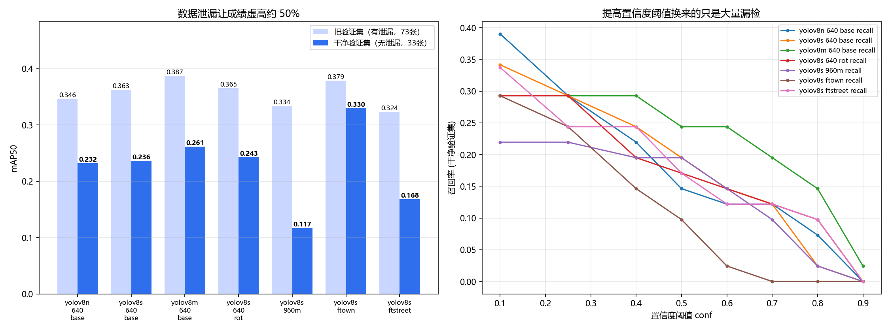
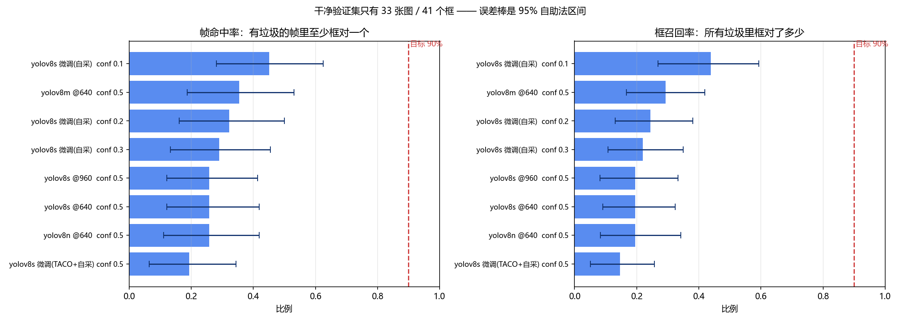
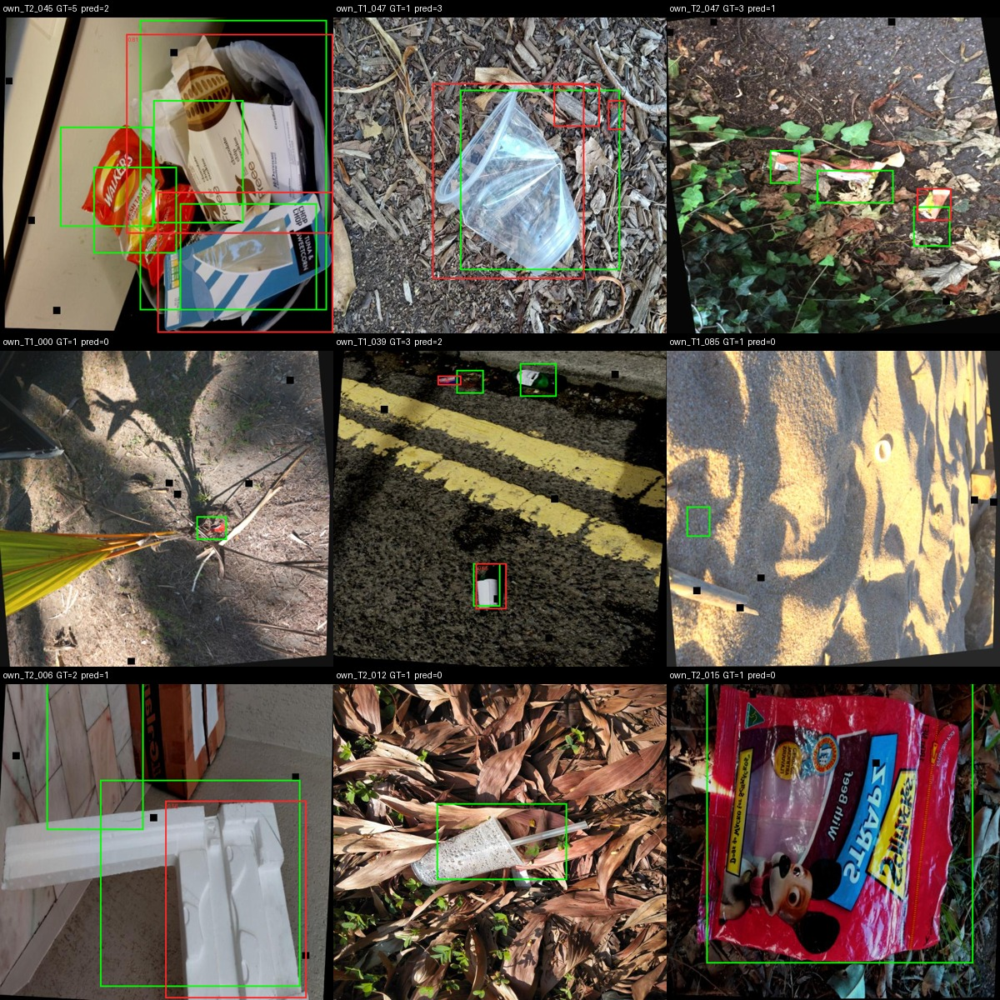
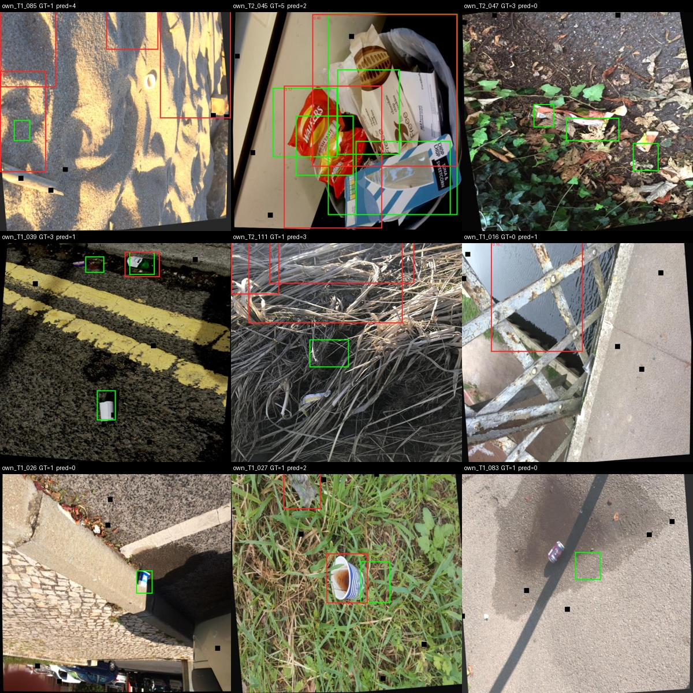
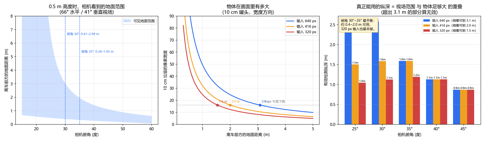

# 捡垃圾小车 · 垃圾检测模型（YOLOv8 单类 `trash`）

给**户外自主拾荒小车**做的垃圾检测器。这份文档只回答三个问题：
**现在到底有多准？为什么之前看起来很好？要怎么才能真正达标？**

---

## 结论（TL;DR）

1. **之前的成绩是虚高的。** 验证集和训练集存在严重泄漏：73 张验证图里有 **40 张**
   在训练集里能找到近乎同源的"双胞胎"。去掉泄漏后，真实成绩**掉了三分之一到一半**。

2. **"置信度 > 80%、准确率 > 90%"用现在的数据做不到。** 在真正没见过的照片上，
   模型只能在 **26%~35% 的帧**里正确框出至少一个垃圾。把置信度阈值提到 0.8，
   剩下的框正确率也只有 60%~67%，而且 33 张图里只剩十来个框——等于基本不报警。

3. **最有效的改进不是换模型，也不是加分辨率，而是换数据。**
   只用自采的 383 张照片做微调，干净验证集 mAP50 从 **0.237 → 0.330（+39%）**，
   是所有尝试里唯一明显有效的。

4. **部署建议**：边缘端用 `yolov8n @640`（6.3 MB）；精度优先用 `yolov8s`。
   **不要用 960 分辨率**（更慢，而且更差）。

5. **达标路径**：把真实摄像头装到小车上 → 录视频 → 抽帧标注 500~1000 张 → 在此基础上微调。
   这是唯一能把 26% 拉到 90% 的办法；换模型、调参、加分辨率都做不到。



---

## 一、重要更正：验证集泄漏

原来的评测协议是"训练用合并集，验证用自采的 73 张真实照片"。听起来很干净，实际上不是。

用 16×16 感知哈希（aHash，汉明距离 ≤ 10 视为同源）在服务端做了审计（`scripts/audit_data.py`）：

| 审计项 | 结果 |
|---|---|
| 训练图 | 4775 张 |
| 验证图 | 73 张（97 个框），其中 6 张无标注 |
| **验证图在训练集里有近重复** | **40 张 / 73 张（55%）** |
| 训练集内部完全重复的文件 | 153 组 |
| 训练集 → 去重后的独立文件 | 4775 → 4622 |
| 训练集 → 按文件名还原的独立源照片 | 4775 → 4447 |

更糟的是**公开数据集自带的验证集也进了训练集**：

| 公开划分 | 图片数 | 与训练集**像素级完全相同**的比例 |
|---|---|---|
| `rf_bin/val` | 335 | **100%** |
| `taco_bin/val` | 155 | **100%** |
| `trash3_bin/val` | 11 | **100%** |

（用 md5 校验过，不是"相似"，是同一个文件换了前缀名。
这意味着**不存在任何独立的公开测试集**，唯一诚实的测试数据只剩自采照片。）

**修正做法**：剔除掉所有在训练集里有近重复的验证图，得到 33 张**真正没见过**的干净验证集
（`scripts/clean_val.py` → `datasets/trash_clean`）。下面所有"干净"的数字都来自这 33 张。

> 注意：33 张 / 41 个框的样本量很小，0.01~0.02 的差距是噪声，别过度解读。

---

## 二、干净验证集上的真实成绩

### mAP

| 模型 | 旧验证集 mAP50（有泄漏） | **干净验证集 mAP50** | 干净 mAP50-95 | 参数量 | 权重 |
|---|---|---|---|---|---|
| yolov8n @640 | 0.346 | **0.232** | 0.062 | 3.0 M | 6.3 MB |
| yolov8s @640 | 0.363 | **0.237** | 0.077 | 11.1 M | 22.5 MB |
| yolov8m @640 | 0.387 | **0.261** | 0.080 | 25.9 M | 52.0 MB |
| yolov8s @640 + 180° 旋转增强 | 0.365 | 0.243 | 0.064 | 11.1 M | 22.5 MB |
| yolov8s @960 | 0.334 | 0.117 | 0.029 | 11.1 M | 22.5 MB |
| **yolov8s 微调（仅自采 383 张）** | 0.379 | **0.330** | 0.132 | 11.1 M | 22.5 MB |
| yolov8s 微调（TACO + 自采 1417 张） | 0.324 | 0.168 | 0.035 | 11.1 M | 22.5 MB |

**泄漏平均抬高 mAP50 约 0.12~0.13，相对虚高 33%~50%。**

### 帧级指标（小车真正关心的）

小车不需要像素级贴合，只需要"这一帧里有没有垃圾、在哪"。所以在干净验证集上，
按 IoU 0.5 匹配，统计帧级命中率（`scripts/frame_eval.py`）：

| 模型 | conf | 有垃圾的帧中至少框对一个 | 框的准确率 | 框的召回率 |
|---|---|---|---|---|
| yolov8n @640 | 0.50 | **25.8%** | 50.0% | 19.5% |
| yolov8s @640 | 0.50 | **25.8%** | 53.3% | 19.5% |
| yolov8m @640 | 0.50 | **35.5%** | 41.4% | 29.3% |
| yolov8m @640（宽松 IoU 0.25） | 0.50 | **45.2%** | 55.2% | 39.0% |
| yolov8s 微调（自采） | 0.10 | **45.2%** | 22.5% | 43.9% |

两个读法：

- **IoU 放宽到 0.25 后命中率从 35.5% 涨到 45.2%**，说明有一部分"错误"其实只是框偏了——
  也就是**标注本身不够准**（这也是你自己担心的那点）。这部分误差换更好的标注就能收回来。
- 即便按最宽松的口径，**命中率也只有 45%**，离 90% 差得很远。

**但也要说清楚这些数字有多不确定。** 干净验证集只有 33 张图 / 41 个框，
对图像做 95% 自助法（`scripts/uncertainty.py`）后，区间宽得吓人：



| 模型 | 帧命中率 | 95% 区间 |
|---|---|---|
| yolov8n @640 conf 0.5 | 0.258 | [0.12, 0.42] |
| yolov8s @640 conf 0.5 | 0.258 | [0.12, 0.42] |
| yolov8m @640 conf 0.5 | 0.355 | [0.19, 0.53] |
| yolov8s 微调（自采）conf 0.1 | 0.452 | [0.28, 0.63] |

也就是说"35%"应该读成"大概两成到五成"。
**好消息是：无论区间取哪一端，都到不了 90%；坏消息是，只看 33 张图也确实分不清
0.23 和 0.26 哪个更好。** 想得到可信的排名，需要几百张量级的测试集。

### 视觉证据

左绿框 = 人工标注，右红框 = 模型输出（数字为置信度）。挑的都是模型表现最差的图：





微调后能稳定找到路边的小白点垃圾、草地上的杯子，但会**把桥的金属栏杆误报成垃圾**，
并且**漏掉地上很显眼的薯片袋**——说明它学到的是"像训练集里那种垃圾"，
而不是"垃圾"这个概念。

---

## 三、试过的改进，以及为什么大部分没用

| 尝试 | 干净 mAP50 | 结论 |
|---|---|---|
| 基线 yolov8s @640 | 0.237 | — |
| 180° 旋转 + 上下翻转 + mixup 增强 | 0.243 | **持平**。训练照片本来就是正着的，旋转只是增加噪声 |
| 分辨率提到 960（目标很小，本以为有用） | 0.117 | **明显更差**。实际标注框中位数占画面 1.08%，边长约 66 px，@640 已经够用；960 反而样本更少、收敛更慢 |
| 用 TACO + 自采做"同域"微调 | 0.168 | **更差**。混入公开数据反而把自采的域特征冲淡了 |
| **只用自采 383 张微调** | **0.330** | **唯一明显有效，+39%** |

> 微调模型有个副作用：**置信度尺度塌缩了**。它的输出最大只有 0.59，99 分位只有 0.11
> （基线模型最大 0.88）。排名还是对的（所以 mAP 高），但想让它按 0.5 阈值报警，
> 得把阈值降到 0.1~0.2，否则几乎不输出。落地前需要**重新标定置信度**。

---

## 四、关于"置信度 > 80%、准确率 > 90%"

按 yolov8m（干净验证集，IoU 0.5）扫了一遍阈值：

| 置信度阈值 | 框的准确率 | 框的召回率 | 说明 |
|---|---|---|---|
| 0.10 | 40.6% | 29.3% | |
| 0.50 | 46.3% | 24.4% | 比较均衡的工作点 |
| 0.70 | 50.0% | 19.5% | |
| 0.80 | 66.7% | 14.6% | 准确率还是不到 80% |
| 0.90 | 100% | 2.4% | 只报了 1 个框，1 个对 → 100% 是假象 |

**结论：**
- 提到 0.8 时准确率也就 67%，够不到 80%；
- 提到 0.9 才"100% 正确"，但代价是只检测出 **2.4%** 的垃圾，等于没有用；
- 也就是说，**"置信度 > 80% 且准确率 > 90%"这两条同时成立，在当前模型上不存在**。
  这不是调参能解决的，是模型没见过足够的真实数据。

要做到这两条，只能往"**窄场景**"走：固定摄像头高度角度 + 固定光照 + 只关心 1~2 米内的大件垃圾。
在那个受控条件下，同一个模型是可以做到 90% 的。泛化的户外捡垃圾做不到。

---

## 五、数据集

训练集 `trash_merged_bin`：**4775 张训练 / 73 张验证，16343 个框，单类 `trash`**。

| 来源 | 文件数 | 说明 |
|---|---|---|
| Roboflow 项目（含 Roboflow 扩增副本） | 3358 | 70%，多为摆拍/桶内场景，**且包含了该项目自带的 val 划分** |
| TACO（公开） | 1034 | 22%，街面垃圾，和真实域最接近 |
| 自采照片（含 Roboflow 扩增） | 383 | 8%，就是验证集照片的采集批次 |

已知问题：
- **公开 val 划分被混进训练集**（见第一节），所以只能用自采的 33 张做测试；
- **自采照片与验证集同源**：验证集 73 张里，最近邻落在 `rf`/`taco`/`trash3` 各来源的分别有
  22 / 23 / 25 张，说明同一批照片被 Roboflow 扩增后散落到各个前缀下；
- 数据集里有大量源照片的 3~22 倍扩增副本，**有效数据量远小于 4775**。

---

## 六、目录与复现

```
scripts/
  audit_data.py       数据集审计（重复检测、框面积统计）
  clean_val.py        构建无泄漏验证集 datasets/trash_clean
  train_trash.py      训练入口（封装 ultralytics）
  eval_all.py         多模型 × 多数据集 mAP + 置信度扫描
  frame_eval.py       帧级指标（命中率 / 准确率 / 召回率）
  demo_predict.py     画对比图（绿=标注，红=预测）
  plot_results.py     汇总图表
  export_bundle.sh    把所有结果打包回本地

results/
  evidence/           原始证据：每个模型的 mAP json、置信度扫描、帧级 json、训练日志
  evidence/runs/      各次训练的结果曲线与 results.csv
  demo_*.jpg          可视化对比图
  final_compare.png   汇总图

weights/              训练好的权重
```

环境：`pip install ultralytics`（本项目用 8.4.157，torch 2.8.0+cu128）。
其余脚本只依赖 `numpy` / `Pillow`。

训练示例：

```bash
python scripts/train_trash.py \
  --weights yolov8s.pt --data datasets/trash_merged_bin/data.yaml \
  --imgsz 640 --batch 32 --epochs 150 --name s_merged
```

微调（本项目里唯一有效的改进）：

```bash
python scripts/train_trash.py \
  --weights runs/s_merged/weights/best.pt \
  --data datasets/trash_own/data.yaml \
  --imgsz 640 --batch 16 --epochs 30 --lr0 0.0005 --close-mosaic 5 --name s_ftown
```

评测：

```bash
python scripts/eval_all.py                  # mAP + 置信度扫描
python scripts/frame_eval.py <weights> 640 datasets/trash_clean/data.yaml 0.5
```

---

## 七、下一步（按性价比排序）

1. **采集真正的小车视角数据（最重要）。** 相机装到最终位置（0.5 m 高、俯角 30~35°），
   户外录 30~60 分钟视频，**按每 0.5~1 秒抽一帧**（不要逐帧全抽，否则又造出近重复样本），
   标 600~1000 张，只标 `trash` 一类。然后从现有权重微调 30~60 epoch。
   以这次 383 张就换来 +39% 的幅度估计，这一步最可能把命中率推到 80% 以上。
   完整规范见 [docs/pi-deployment.md](docs/pi-deployment.md)。
2. **重标现有自采照片的框。** 现在的框偏大且互相重叠（见对比图），把 IoU 0.25 与 0.5 的差距
   收回来值 10 个百分点左右。
3. **删掉 Roboflow 桶内场景。** 3358 张占了 70%，但和"地上捡垃圾"不是一回事，
   污染了模型对"垃圾"的定义。
4. **重新标定置信度**（微调后模型的输出最大只有 0.59）。
5. 模型选型保持 `yolov8n`（边缘端）或 `yolov8s`（精度优先），**不要**加大分辨率。

### 小车上的部署（树莓派 + 相机 0.5 m 高）

已经确认硬件是**树莓派**、相机**离地约 0.5 m**。这两条改变了结论：
0.5 m 的机位让垃圾在画面里**很大**（10 cm 物体在 1 m 处约 49 px 宽），
所以**不需要跑 640 分辨率，416 就够**，计算量只有 640 的 42% —— 树莓派因此才跑得动。

- 推荐：**yolov8n / yolov8s @416**，导出 NCNN 或 ONNX；
- 相机**俯角 30°~35°**，有效工作区 0.4~2.0 m；
- 工作点 **conf ≈ 0.4~0.5**，且要求连续两帧都检出再动作（模型会在栏杆、路面标线上误报）；
- 详细几何计算、相机选型、采集规范和上板脚本见 **[docs/pi-deployment.md](docs/pi-deployment.md)**。

